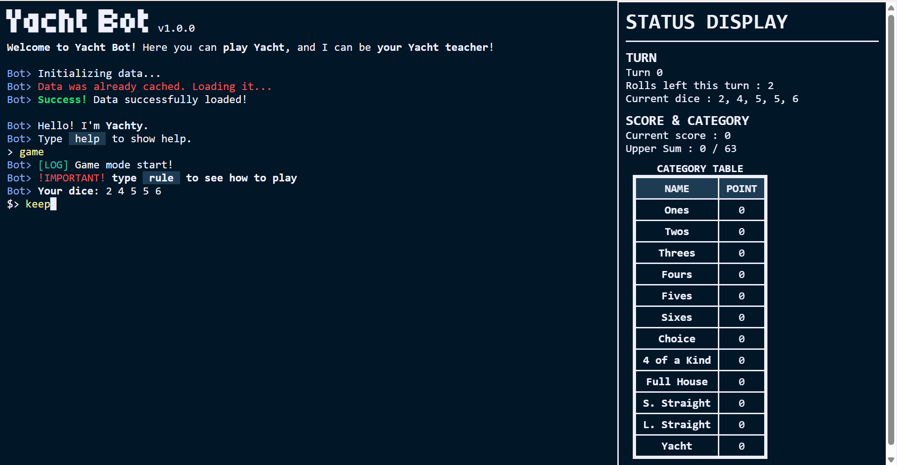

# ヨットボット - Yacht Bot - v1.0.0



これはターミナル風の対話型のヨットのボットです。
ブラウザで動きます。
ユーザーはボットと対戦するか、ダイスを入力して最適解を知ることができます。
日本語、英語両対応です。
色のテーマは私の好きな[Night Owl](https://github.com/sdras/night-owl-vscode-theme)を参考にしています。

## 特徴

- クライアントサイドだけで完全に動作する
- ヨットゲームをインタラクティブにプレイ
- ヨットの最適解を計算するソルバーを搭載
- ヨットの最適解ボットを試せる
- 英語・日本語両対応

などなど

## 使用方法

### ローカルで動かしたい場合
1. githubからZIPとしてダウンロードして解凍する
2. `index.html`を開きます

### Web上で気軽に遊びたい場合
1. [https://xc-studio.github.io/yacht-bot](https://xc-studio.github.io/yacht-bot)にアクセスする

## お問い合わせ

バグ報告や改善提案は、次の匿名フォームから送信できます。
アカウント不要で、気軽に投稿できます。

URL - (作成中)

## ファイル構成

```
/assets                 README用の画像置き場
    demo.png            タイトルのロゴ

/src                    ソースコード置き場
    /css                
        style.css       全CSS

    /dialogue           ゲームに出てくる全会話
        common.js       共通して使うクラス定義
        en.js           英語用
        ja.js           日本語用

    /js                 スクリプト
        game.js         ゲームの進行を司る
        main.js         アプリの流れを司る
        solver.js       ボットの中身
        ui.js           UI用の処理
        utils.js        それ以外の定義物

API.md                  solver.jsの仕様
index.html              アプリ本体
README.md               あなたが今見ているもの
```

## ライセンス

MIT

## リリース日

2026/08/27